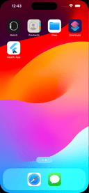
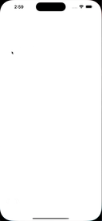
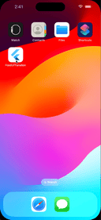

# legendary-system

Welcome to the **Legendary System** repository! This repository is a showcase of the various applications I've developed, highlighting my journey and expertise in software development, particularly in Flutter. Here, you'll find innovative and impactful apps designed to solve real-world problems and provide seamless user experiences.

## Current Projects

### 1. [Health App](https://github.com/GhagSagar23/legendary-system/tree/develop/healthapp)

The **Health App** is the first application in this repository, demonstrating a robust and user-friendly platform for managing personal health and wellness. This app offers a range of features to help users track their fitness activities, monitor vital health metrics, and achieve their health goals.

#### Key Features:

- **Activity Tracking**: Log daily activities such as walking, running, and cycling.
- **Health Metrics**: Monitor vital signs like heart rate, blood pressure, and more.
- **Goals and Reminders**: Set health goals and receive reminders to stay on track.
- **User-Friendly Interface**: Enjoy an intuitive and seamless user experience.

#### Technologies Used:

- **Flutter**: Leveraging the power of Flutter for a smooth and responsive cross-platform app.
- **Dart**: Implementing efficient and maintainable code with Dart.
- **Firebase**: Integrating Firebase for real-time database and authentication.

#### Screenshots:

### 2. [Finance App](https://github.com/GhagSagar23/legendary-system/tree/develop/financeapp)

The **Finance App** is a comprehensive financial management tool designed to help users track their expenses, manage budgets, and achieve financial stability. This app offers a range of features to simplify money management and empower users to make informed financial decisions.

#### Key Features:

- **Expense Tracking**: Log daily expenses and categorize transactions for better visibility.
- **Card Management**: Manage credit and debit cards, track spending, and set limits.
- **Apperance Customization**: Personalize the app with themes, colors, and fonts.

#### Technologies Used:

- **Flutter**: Utilizing Flutter for a responsive and visually appealing user interface.
- **Dart**: Writing clean and efficient code with Dart programming language.
- **SQLite**: Implementing a local database for storing user data securely.

#### Screenshots:

### 3. [Pizza App](https://github.com/GhagSagar23/legendary-system/tree/develop/pizzaapp)

The **Pizza App** is a delightful food ordering application that allows users to browse a variety of pizzas, customize their orders, and place them seamlessly. This app offers a range of features to enhance the user experience and make ordering pizza a fun and convenient process.

#### Key Features:

- **Pizza Selection**: Browse a wide selection of pizzas with detailed descriptions and images.
- **Customization Options**: Customize pizzas with toppings, crusts, and sizes to suit your preferences.
- **Order Placement**: Place orders quickly and securely with a few taps on the app.

#### Technologies Used:

- **Flutter**: Building a visually appealing and interactive user interface with Flutter.
- **Dart**: Writing clean and efficient code with Dart programming language.
- **Firebase**: Integrating Firebase for real-time database and authentication.

#### Screenshots:

## About Me

I am Sagar, a Flutter Tech Lead with extensive experience in mobile app development. Over the past six years, I've honed my skills in iOS and Flutter development, leading a team of talented developers to create high-quality applications. My passion for long motorcycle rides, swimming, and exploring new music genres fuels my creativity and drive in the tech world.

## Contributing

Contributions are welcome! If you have suggestions, ideas, or enhancements, feel free to open an issue or submit a pull request. Let's collaborate to make these applications even better.

## License

This repository is licensed under the MIT License. For more details, please refer to the [LICENSE](LICENSE) file.

## Contact

Feel free to reach out to me on [LinkedIn](https://www.linkedin.com/in/ghag23/) or via email at [sagar.ghag1997@gmail.com](mailto:sagar.ghag1997@gmail.com) for any queries or collaboration opportunities.

Thank you for visiting the **Legendary System** repository. Stay tuned for more exciting applications!
