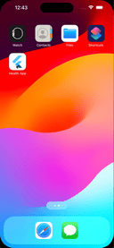

### [Health App](https://github.com/GhagSagar23/legendary-system/tree/develop/healthapp)

The **Health App** is the first application in this repository, demonstrating a robust and user-friendly platform for managing personal health and wellness. This app offers a range of features to help users track their fitness activities, monitor vital health metrics, and achieve their health goals.

#### Key Features:

- **Activity Tracking**: Log daily activities such as walking, running, and cycling.
- **Health Metrics**: Monitor vital signs like heart rate, blood pressure, and more.
- **Goals and Reminders**: Set health goals and receive reminders to stay on track.
- **User-Friendly Interface**: Enjoy an intuitive and seamless user experience.

#### Technologies Used:

- **Flutter**: Leveraging the power of Flutter for a smooth and responsive cross-platform app.
- **Dart**: Implementing efficient and maintainable code with Dart.
- **Firebase**: Integrating Firebase for real-time database and authentication.

#### Screenshots:

